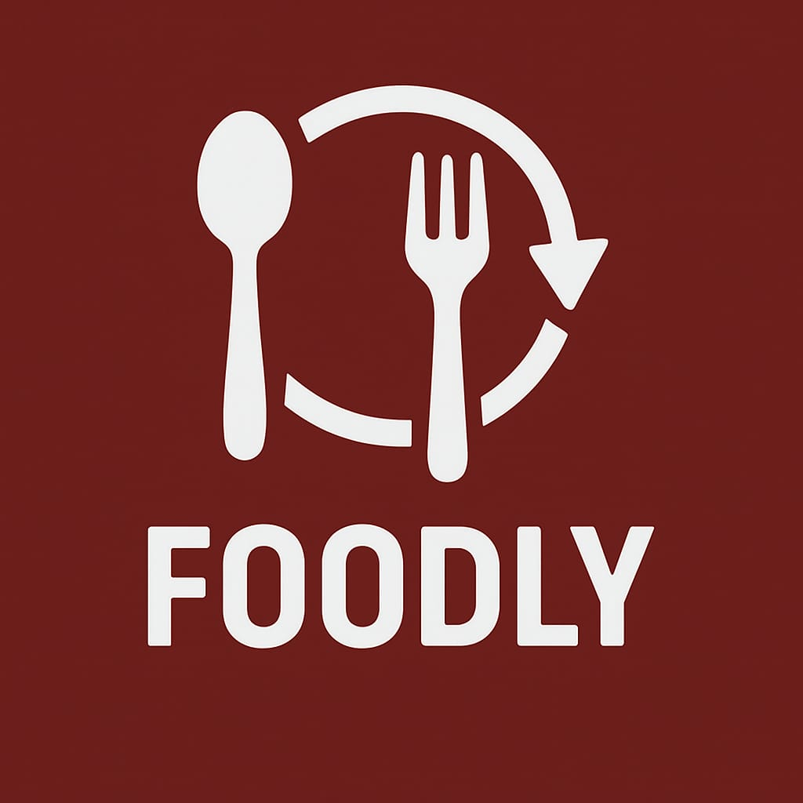
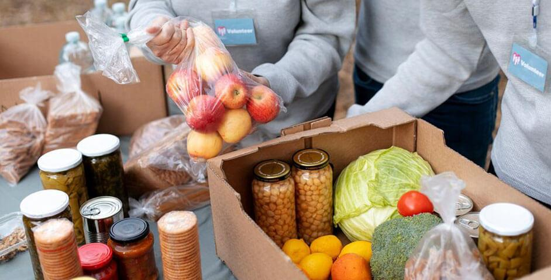
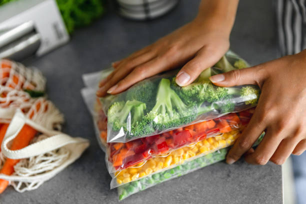

<!DOCTYPE html>
<html lang="en">

<head>
    <meta charset="utf-8">
    <meta http-equiv="X-UA-Compatible" content="IE=edge">
    <meta name="viewport" content="width=device-width, initial-scale=1">
    <meta name="description" content="">
    <meta name="author" content="">
    <title>Foodly Index</title>

    <!-- =============== Bootstrap Core CSS =============== -->
    <link rel="stylesheet" href="assets/css/bootstrap.min.css" type="text/css">
    <!-- =============== fonts awesome =============== -->
    <link rel="stylesheet" href="assets/font/css/font-awesome.min.css" type="text/css">
    <!-- =============== Plugin CSS =============== -->
    <link rel="stylesheet" href="assets/css/animate.min.css" type="text/css">
    <!-- =============== Custom CSS =============== -->
    <link rel="stylesheet" href="assets/css/style.css" type="text/css">
    <!-- =============== Owl Carousel Assets =============== -->
    <link href="assets/owl-carousel/owl.carousel.css" rel="stylesheet">
    <link href="assets/owl-carousel/owl.theme.css" rel="stylesheet">
	
	 <link rel="stylesheet" href="assets/css/isotope-docs.css" media="screen">
	  <link rel="stylesheet" href="assets/css/baguetteBox.css">
    <!-- HTML5 Shim and Respond.js IE8 support of HTML5 elements and media queries -->
    <!-- WARNING: Respond.js doesn't work if you view the page via file:// -->
    <!--[if lt IE 9]>
        
        
    <![endif]-->
	
</head>

<body>
    <!-- =============== Preloader =============== no es indispensable y casi no se va a ver asi que se podría quitar -->
    

        

			
        

    

    <!-- =============== nav =============== -->
    <nav id="mainNav" class="navbar navbar-default navbar-fixed-top">
        

            

                <!-- Brand and toggle get grouped for better mobile display -->
                

                    <button type="button" class="navbar-toggle collapsed" data-toggle="collapse" data-target="#bs-example-navbar-collapse-1">
                        Toggle navigation
                        
                        
                        
                    </button>
                    
                    </a>
                

                <!-- Collect the nav links, forms, and other content for toggling -->

                

                    <ul class="nav navbar-nav navbar-right">
						<li>
                            <a class="page-scroll" href="#home">Home</a>
                        </li>
                        <li>
                            <a class="page-scroll" href="#about">Sección informativa</a>
                        </li>
                        <li>
                            <a class="page-scroll" href="#Services">Servicios</a>
                        </li>
                        <li>
                            <a class="page-scroll" href="#Gallery">Galería</a>
                        </li>
                        <li>
                            <a class="page-scroll" href="#blog">Blog</a>
                        </li>
                    </ul>
                

                <!-- =============== navbar-collapse =============== -->

            

        

        <!-- =============== container-fluid =============== -->
    </nav>
    <!-- =============== header =============== -->
    <header id="home" class="header">
		<!-- =============== container =============== -->
        

            

				

				

				  

				  
<!-- Viñeta para la frase de impacto-->
                    <h2 class="wow bounceIn animated" data-wow-delay=".40s">"Donamos lo que tenemos, porque creemos en compartir"</h2>
                    <h3 class="wow bounceIn animated" data-wow-delay=".50s">Foodly</h3>
                    

                    

                        
<i class="hbtn"></i> Click Here</i>
                        

                    

					
               
				

				 

				  
<!-- Viñeta y botón para la app web-->
                    <h2 class="wow bounceIn animated" data-wow-delay=".40s">Visita nuestraApp Web</h2>
                    <h3 class="wow bounceIn animated" data-wow-delay=".50s">Aydanos a impulsar nuestra iniciativa visitando nuestra app web</h3>
                    

                    

                        
<i class="hbtn"></i> Click Here</i>
                        

                    

					
               
				

				
				 
				

                
        

		<!-- =============== container end =============== -->
    </header>
    <!-- =============== About =============== -->
    <section id="about" class="">
		<!-- =============== container =============== -->
        
            
            

                

                   <h2>Sección informativa</h2>
				   
El desperdicio de alimentos es una de las problemáticas más alarmantes y paradójicas del siglo XXI. En un mundo donde se produce suficiente comida para alimentar a toda la población global, millones de personas siguen padeciendo hambre, mientras toneladas de alimentos son desechadas diariamente. Esta situación no solo genera profundas implicaciones sociales, sino también económicas y ambientales. 

				   
Se desperdicia un tercio de los alimentos producidos mundialmente.  
Esto equivale a más de 1,300 millones de toneladas al año, según datos de 
organismos internacionales como la FAO y el PNUMA. El problema no solo afecta la 
disponibilidad de alimentos, sino también el uso excesivo de recursos naturales 
para producir comida que nunca será consumida.

                  

                  

                                     
                  
     
            

        
   
		<!-- =============== container end =============== -->		
    </section>
	<section id="team" class="">
    

        

            

            <h2  style="font-family: 'Palatino Linotype', 'Book Antiqua', Palatino, serif;
            text-align: left;
  font-size: 22px;
  font-weight: normal;
  color: white;
  margin: 0;
  letter-spacing: 0.5px;>Hogares">Estadisticas locales (El Salvador)</h2>    
            
Cada año se desperdician 579,084 toneladas de alimentos en El Salvador.  
Esta cifra revela una tendencia creciente en el país, afectando tanto la economía 
como el medio ambiente. 

                
El Salvador ocupa el cuarto lugar en Centroamérica por volumen de comida 
desperdiciada.  
Está detrás de Guatemala, Honduras y Nicaragua, lo que indica una necesidad 
urgente de políticas y campañas de concienciación para reducir el despilfarro en 
todos los sectores. 

            

        

    

    </section>	
	<!-- =============== Services =============== -->
    <section id="Services" class="">
		<!-- =============== container =============== -->
        
            
            

			 

                                    
                  
     
                

                   <h2>Causas comunes del desperdicio</h2>
	<ul>
        <li>
            <h3  style="font-family: 'Palatino Linotype', 'Book Antiqua', Palatino, serif;
  font-size: 22px;
  font-weight: normal;
  color: #111;
  margin: 0;
  letter-spacing: 0.5px;>Hogares">Hogares</h3>  
            <ul>
                <li>
                    
Compra excesiva sin planificación. 
                    Las familias tienden a adquirir más productos de los necesarios, ya sea por 
                    promociones o costumbre, lo que termina en una acumulación innecesaria.

                </li>
                <li >
                    
Desconocimiento sobre fechas de vencimiento. 
                    Se confunden términos como "fecha de caducidad" y "consumo preferente", lo que 
                    lleva al desecho de alimentos que aún son aptos para el consumo.

                </li>
            </ul>
        </li>
        <li>
            <h3  style="font-family: 'Palatino Linotype', 'Book Antiqua', Palatino, serif;
  font-size: 22px;
  font-weight: normal;
  color: #111;
  margin: 0;
  letter-spacing: 0.5px;>Hogares">Restaurantes</h3>  
            <ul>
                <li>
                    

Porciones grandes que no se consumen,la cultura de servir platos abundantes genera desperdicio cuando los comensales 
                    no terminan su comida.

                </li>
                <li>
                    
Sobrantes que no se reutilizan. 
                    En eventos o buffets se genera mucha comida que no es aprovechada ni distribuida 
                    adecuadamente, y suele terminar en la basura.

                </li>
            </ul>
        </li>
        <li>
            <h3  style="font-family: 'Palatino Linotype', 'Book Antiqua', Palatino, serif;
  font-size: 22px;
  font-weight: normal;
  color: #111;
  margin: 0;
  letter-spacing: 0.5px;>Hogares">Supermercados</h3>  
            <ul>
                <li>
                    
Rechazo de productos por estética o vencimiento cercano. 
                    Aunque estén en buen estado, los productos con empaques dañados o menos atractivos no se venden y se desechan.

                </li>
                <li>
                    
Falta de canales para donar alimentos en buen estado. 
                    No hay infraestructuras ni acuerdos claros para canalizar alimentos que aún pueden ser utilizados, lo que representa una oportunidad perdida para ayudar a quienes lo necesitan.

                </li>
            </ul>
        </li>
    </ul>
      
                

            

        
   
		<!-- =============== container end =============== -->		
    </section>	
	<!-- =============== for box =============== -->		
	<section class="for-box">
	 

		

			

				

					<i class="fa fa-home"></i>
				

				
				
				<h2>
					Beneficios De Reutilizar
				</h2>
				

				

					<strong>Ambientales</strong>
					
- Menos residuos sólidos y menor contaminación.
                       - Reducción de emisiones por transporte y producción innecesaria.
                    - Al disminuir la demanda de productos nuevos, se reducen también los costos
                        ambientales relacionados con su fabricación y distribución.

					<a href="#" class="clr1-a">+</a>
				

				
			

			

				

					<i class="fa fa-code"></i>
				

				
				
				<h2>
					Beneficios De Reutilizar
				</h2>
				

				

					<strong>Sociales</strong>
					
 
                    - Apoyo directo a comunidades vulnerables mediante donaciones.
                    - Iniciativas como "Wasted Food El Salvador".
                    Este tipo de esfuerzos canaliza alimentos en buen estado hacia comedores
                    comunitarios y otras organizaciones sociales.

					<a href="#" class="clr2-a">+</a>
				

				
			

			

				

					<i class="fa fa-rocket"></i>
				

				
				
				<h2>
					Beneficios De Reutilizar
				</h2>	
				

				

					<strong>Económicos</strong>
					
 
                        - Ahorro en costos de disposición de residuos.
                        - Posibilidad de generar empleo.
                        La logística para recolectar, almacenar y redistribuir alimentos requiere personal.

					<a href="#" class="clr3-a">+</a>
				

			
			

			

				

					<i class="fa fa-wifi"></i>
				

				
				
				<h2>
					Beneficios De Reutilizar
				</h2>
				

				

					<strong>Colaborativo 
</strong>
					
Evitar tirar comida abre puertas a pequeños negocios como conservas caseras, intercambios vecinales o venta de platos preparados. 
                    Lo que antes se consideraba sobrante, ahora puede impulsar oportunidades para la sociedad.
                    Así, cada alimento rescatado representa más que el ahorro, es colaboración y crecimiento.
                    

					<a href="#" class="clr4-a">+</a>
				

				
			

		

	 

	</section>
	<!-- =============== Counter =============== -->
    <section class="counter">
		<!-- =============== container =============== -->
        
            
            

			

				<h2>we are   awesome,   check some interesting facts</h2>				
				

			 

                            <i class="fa fa-clock-o size"></i>
							<h2>522</h2>
							Hour of Work
                  
     
               

                            <i class="fa fa-coffee size"></i>
							<h2>888</h2>
							Cup of Coffee
                  
  
				   

                            <i class="fa fa-trophy size"></i>
							<h2>11</h2>
							Awards Won
                  
  
				   

                            <i class="fa fa-code size"></i>
							<h2>55566</h2>
							Line of Code
                  
  
				   

                            <i class="fa fa-globe size"></i>
							<h2>133</h2>
							Clients Worldwide
                  
  
				   

                            <i class="fa fa-rocket size"></i>
							<h2>77</h2>
							Projects Delivered
                  
  
            

        
   
		<!-- =============== container end =============== -->		
    </section>	
    
<!-- =============== Gallery =============== -->
    <section id="Gallery" class="wow flipInX animated" data-wow-delay=".5s">
	

				<h2>Gallery</h2>				
				
we are   awesome,   check some interesting facts

				

				
</section>
	<section id="blog" class="">
		<!-- =============== container =============== -->
        
            
            

				

				<h2>Our Blog</h2>
				
Meet some of our lovely, passionate, positive people.

				

				 

                   
 
		<!-- =============== container end =============== -->		
    </section>	
    <!-- Footer -->
    <footer id="footer">
	<!-- =============== container =============== -->
    

			    

                

                    <ul class="social-links" >
                        <li><a data-wow-delay=".1s" class="wow fadeInUp animated" href="index.html#" style="visibility: visible; animation-delay: 0.1s; animation-name: fadeInUp;"><i class="fa fa-google-plus"></i></a></li>
                        <li></li>
                        <li></li>
						<li><a data-wow-delay=".2s" class="wow fadeInUp animated" style="visibility: visible; animation-delay: 0.2s; animation-name: fadeInUp;"><i class="fa fa-envelope"></i></a></li>
                        <li>info@grupoq.superate.org.sv</li>
                    </ul>

                    

                    

                        &copy; 2025 Created By <a href="#">Foodly</a>
					

				

				

					  <section class="widget widget_text" id="text-15">
                         <h3 class="widget-title">San Miguel, El Salvador</h3> 
786, Firs Avenue, The Mall, 
                        
Tel: +503 2606 0976 
                        Mobile: +503 2606 0976 
                        E-mail: <a href="#">info@Foodly.com</a>

                        <a href="#">11a Avenida Norte, San Miguel</a> →

                    </section>

				

			

    
<!-- =============== container end =============== -->
	</footer>    
	<!-- =============== jQuery =============== -->
    
	 
    <!-- =============== Bootstrap Core JavaScript =============== -->
    
    <!-- =============== Plugin JavaScript =============== -->
    
    
     
	<!-- =============== owl carousel =============== -->
      
	<!-- Isotope does NOT require jQuery. But it does make things easier -->

 
    <!-- =============== Custom Theme JavaScript =============== -->
     

</body>
</html>
